# taskmaster
Lab: 26 - Beginning TaskMaster

Homepage
The main page should be built out to match the wireframe.
In particular, it should have a heading at the top of the page,
an image to mock the “my tasks” view,
 and buttons at the bottom of the page to allow going to the “add tasks” and “all tasks” page.
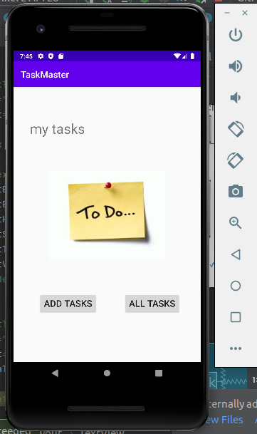
Add a Task
On the “Add a Task” page,
allow users to type in details about a new task, specifically a title and a body.
 When users click the “submit” button, show a “submitted!” label on the page.
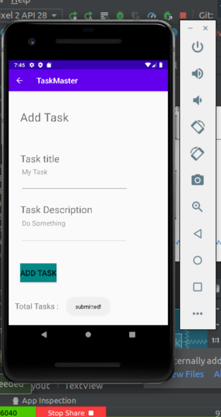

All Tasks
The all tasks page should just be an image with a back button; it needs no functionality.
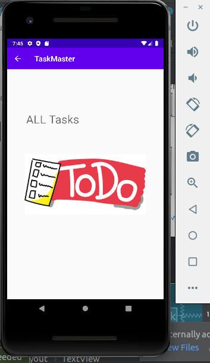

****************************************************************************************************
# Lab: 27 - Data in TaskMaster
### Adding Data to TaskMaster

Task Detail Page
Create a Task Detail page. It should have a title at the top of the page, and a Lorem Ipsum description.
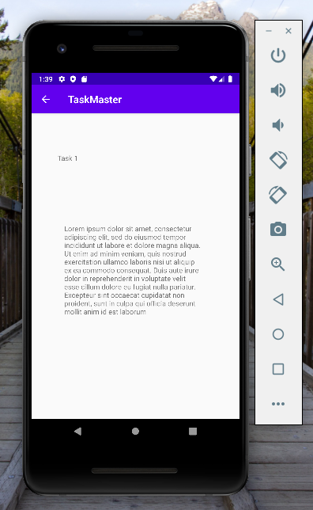
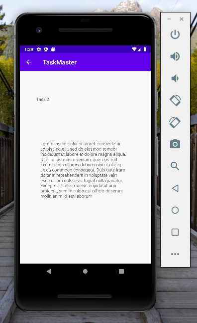

Settings Page
Create a Settings page. It should allow users to enter their username and hit save.
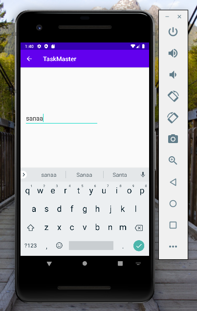

Homepage
The main page should be modified to contain three different buttons with hardcoded task titles.
 When a user taps one of the titles, it should go to the Task Detail page, and the title at the top of the page should match the task title that was tapped on the previous page.

****************************************************************************************************
# Lab: 28 - Data in TaskMaster

RecyclerViews for Displaying Lists of Data

Task Model
Create a Task class. A Task should have a title, a body, and a state. The state should be one of “new”, “assigned”, “in progress”, or “complete”.
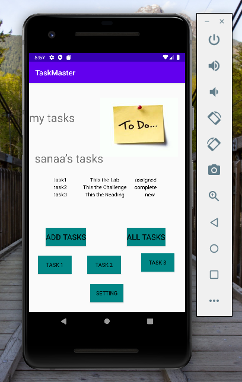

Homepage
Refactor your homepage to use a RecyclerView for displaying Task data. This should have hardcoded Task data for now.

Some steps you will likely want to take to accomplish this:

Create a ViewAdapter class that displays data from a list of Tasks.
In your MainActivity, create at least three hardcoded Task instances and use those to populate your RecyclerView/ViewAdapter.

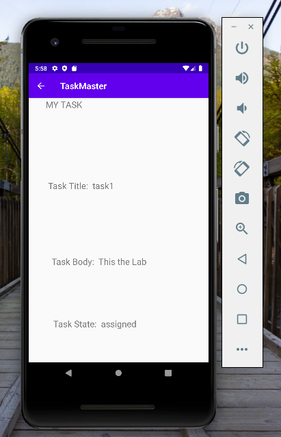
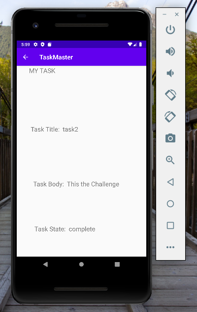
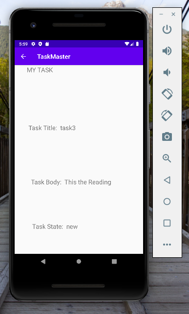

*****************************************************************************************************
# Lab: 29 - Room

# Task Model and Room

Following the directions provided in the Android documentation, set up Room in your application, and modify your Task class to be an Entity.

Add Task Form
Modify your Add Task form to save the data entered in as a Task in your local database.

Homepage
Refactor your homepage’s RecyclerView to display all Task entities in your database.

Detail Page
Ensure that the description and status of a tapped task are also displayed on the detail page,
 in addition to the title. (Note that you can accomplish this by passing along the entire Task entity,
or by passing along only its ID in the intent.)

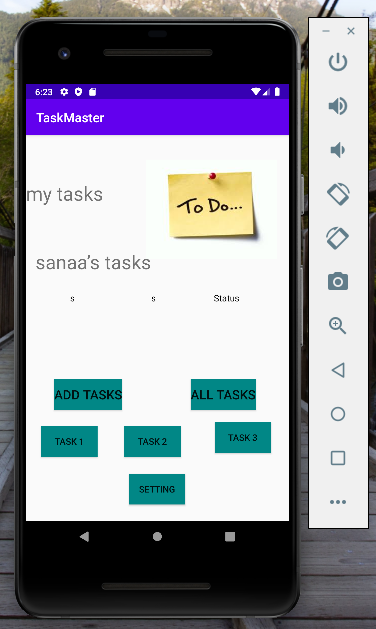
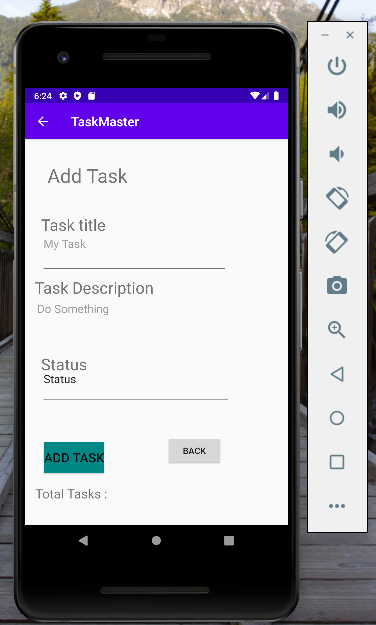
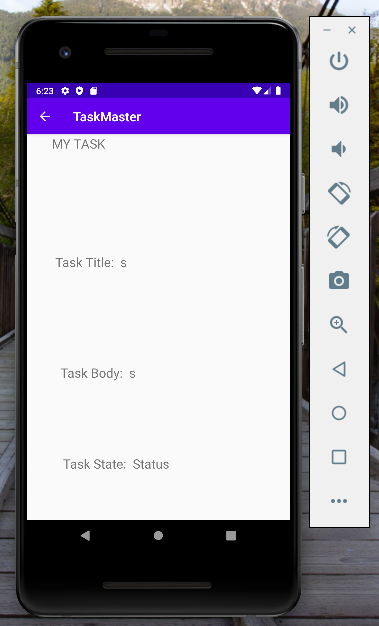