# taskmaster
Lab: 26 - Beginning TaskMaster

Homepage
The main page should be built out to match the wireframe.
In particular, it should have a heading at the top of the page,
an image to mock the “my tasks” view,
 and buttons at the bottom of the page to allow going to the “add tasks” and “all tasks” page.

Add a Task
On the “Add a Task” page,
allow users to type in details about a new task, specifically a title and a body.
 When users click the “submit” button, show a “submitted!” label on the page.

All Tasks
The all tasks page should just be an image with a back button; it needs no functionality.

****************************************************************************************************
# Lab: 27 - Data in TaskMaster
### Adding Data to TaskMaster

Task Detail Page
Create a Task Detail page. It should have a title at the top of the page, and a Lorem Ipsum description.

Settings Page
Create a Settings page. It should allow users to enter their username and hit save.

Homepage
The main page should be modified to contain three different buttons with hardcoded task titles.
 When a user taps one of the titles, it should go to the Task Detail page, and the title at the top of the page should match the task title that was tapped on the previous page.

****************************************************************************************************
# Lab: 28 - Data in TaskMaster

RecyclerViews for Displaying Lists of Data

Task Model
Create a Task class. A Task should have a title, a body, and a state. The state should be one of “new”, “assigned”, “in progress”, or “complete”.

Homepage
Refactor your homepage to use a RecyclerView for displaying Task data. This should have hardcoded Task data for now.

Some steps you will likely want to take to accomplish this:

Create a ViewAdapter class that displays data from a list of Tasks.
In your MainActivity, create at least three hardcoded Task instances and use those to populate your RecyclerView/ViewAdapter.

*****************************************************************************************************
# Lab: 29 - Room

# Task Model and Room

Following the directions provided in the Android documentation, set up Room in your application, and modify your Task class to be an Entity.

Add Task Form
Modify your Add Task form to save the data entered in as a Task in your local database.

Homepage
Refactor your homepage’s RecyclerView to display all Task entities in your database.

Detail Page
Ensure that the description and status of a tapped task are also displayed on the detail page,
 in addition to the title. (Note that you can accomplish this by passing along the entire Task entity,
or by passing along only its ID in the intent.)

****************************************************************************************
## Lab: 31 - Espresso and Polish:
# Test
1. Espresso Testing : Add Espresso to your application, and use it to test basic functionality of the main components of your application
2. Polish : Complete any remaining feature tasks from previous days’ labs.

**********************************************************************************************
## Lab: 32 - Amplify and DynamoDB
Tasks Are Cloudy
Using the amplify add api command, create a Task resource that replicates our existing Task schema. Update all references to the Task data to instead use AWS Amplify to access your data in DynamoDB instead of in Room.

Add Task Form
Modify your Add Task form to save the data entered in as a Task to DynamoDB.

Homepage
Refactor your homepage’s RecyclerView to display all Task entities in DynamoDB.
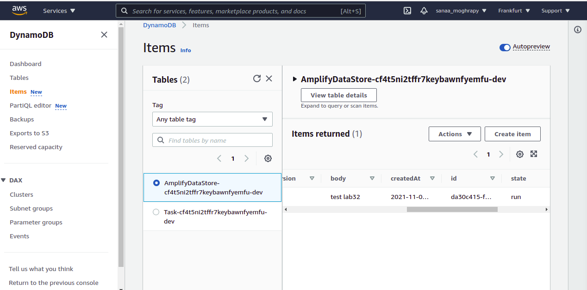
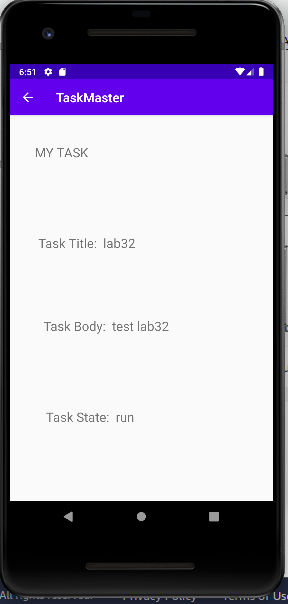
****************************************************************************************************
## Lab: 33 - Related Data
Tasks Are Owned By Teams
Create a second entity for a team, which has a name and a list of tasks. Update your tasks to be owned by a team.

Manually create three teams by running a mutation exactly three times in your code. (You do NOT need to allow the user to create new teams.)

## Add Task Form
Modify your Add Task form to include either a Spinner or Radio Buttons for which team that task belongs to.
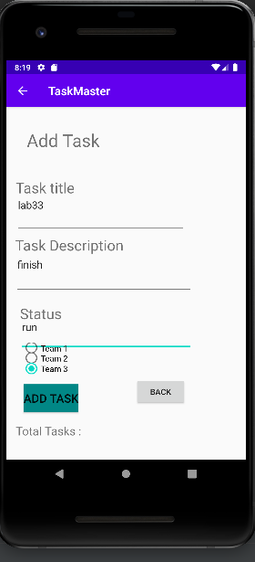

## Settings Page
In addition to a username, allow the user to choose their team on the Settings page. Use that Team to displayonly that team’s tasks on the homepage.
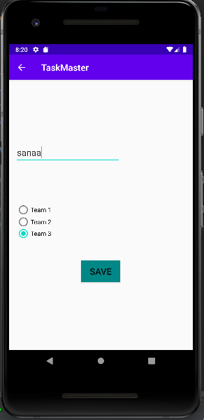
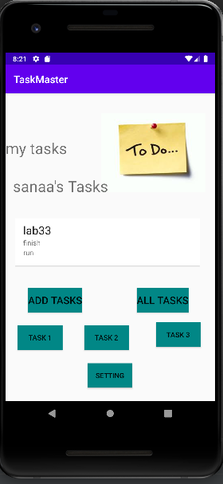

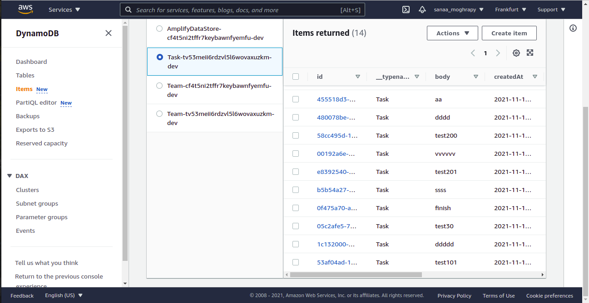
****************************************************************************************************
## Lab 34: Publishing to the Play Store
### This lab is about generate an APK for the application and publishing it to the Google Play Store.
****************************************************************************************************
## Lab: 36 - Cognito
### User Login
Add Cognito to your Amplify setup. Add in user login and sign up flows to your application, using Cognito’s pre-built UI as appropriate. Display the logged in user’s username somewhere relevant in your app.
### User Logout
Allow users to log out of your application.

### Main Page
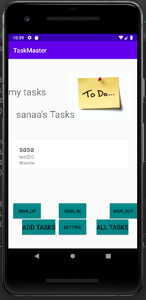
### Sign Up page
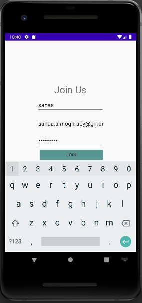

### Log_in

### AWS
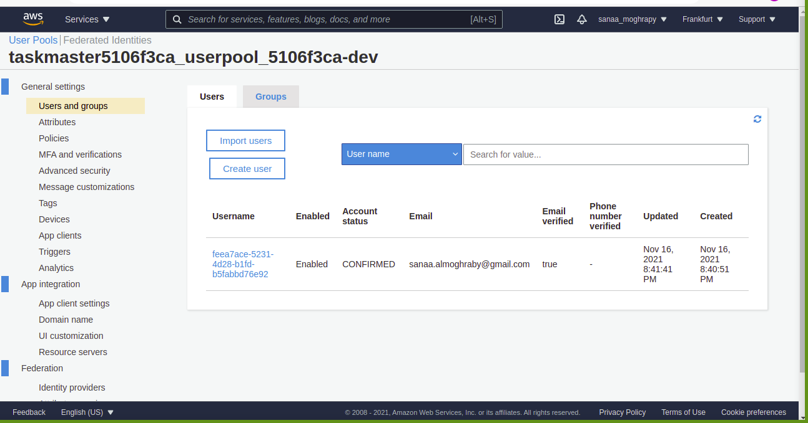
****************************************************************************************************
## Lab 37: S3
### Add Task Activity

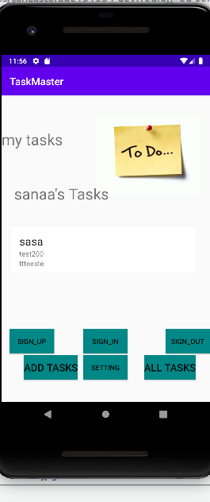

### Download Files Page

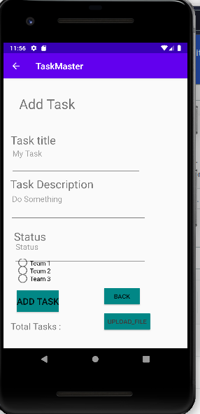
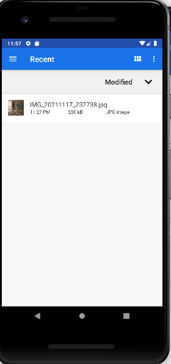

### AWS S3
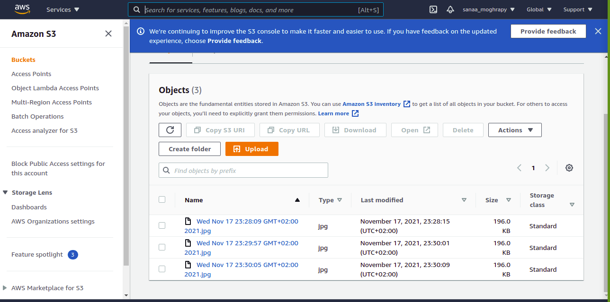
***********************************************************************************************
## Lab 38:  Notifications
### Add Task Activity

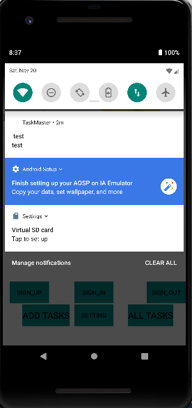

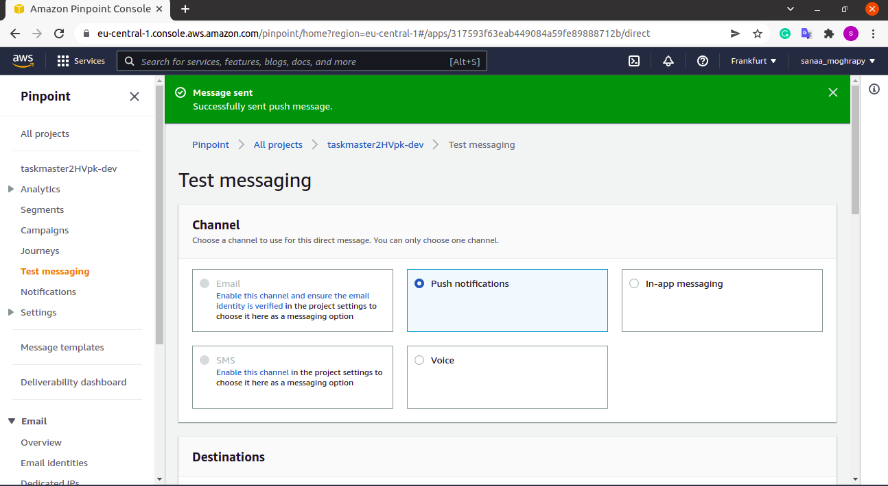
